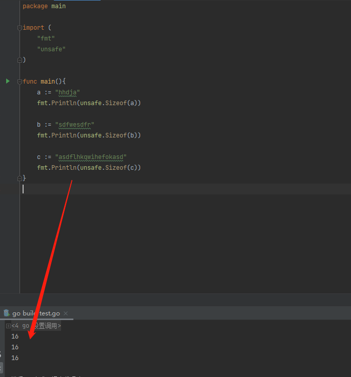
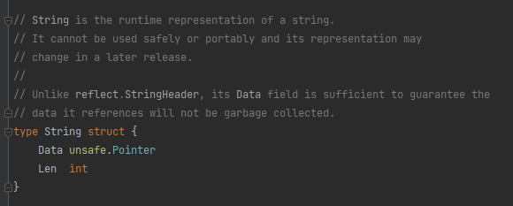
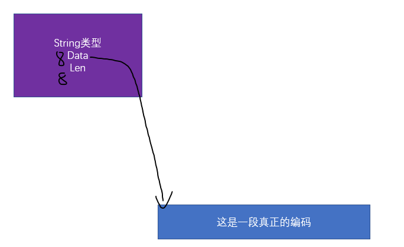
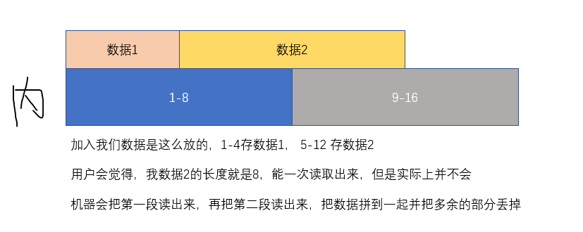
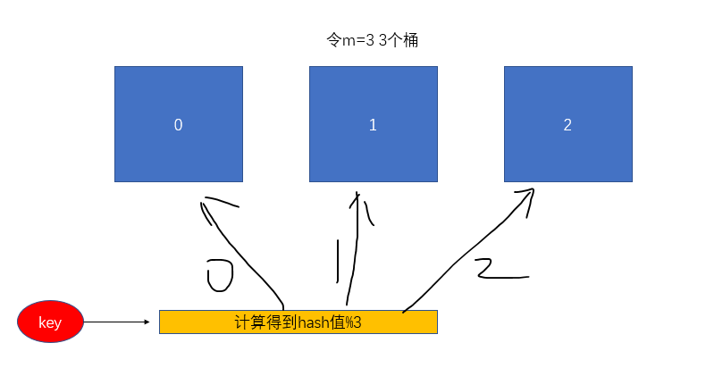
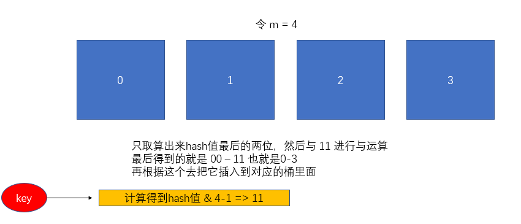

# go-data-structure

go 的数据结构

# string
首先要先了解机string类型在机器编码种的形式

    1、 1 bit 可以是 0/1  8 bit = 1 byte， 可以表示255个数，越多的bit可以表示越大的数字
    2、 stirng类型在机器中是怎么存储的？ --> “A” 在机器中通过编码会用 65 来表示， 01000001
    3、 那怎么表示 "AA" 呢？ 如果不用任何措施就无法知道怎么终止，比如说 0100 0001 0100 0001 要怎么和一个完整的字符区分呢？
    4、 首先最容易想到的一个方法就是使用定长编码，比如说利用编码种最高位来表示所有的字符，也就是说假设现在编码的规则是16个字节，那么所有的
        编码我们都要按照16字节来表示，所以 "AA" 就会表示成：
        0000 0000 0100 0001 0000 0000 0100 0001；
        也很容易发现这个方法会很明显造成内存资源的浪费
    5、 于是出现了变长编码，用0开头表示只占一个字节，110开头占2个字节，1110开头占3个字节，同时除了第一个字节中的标识位，占用多少字节就会
        在后面每个字节开头用10占位：
        比如 用 0100 0001 除去标识符0 剩下 1000001，转化为10进制为65，表示A;
        比如 用 1110 0100 1011 1000 1001 0110 除去 1110 的表示为，表示占用3个bit；再出去后面2个字节的10，剩下的 0100 1110 0001 0110
        转化为十进制是 19990 表示 ”世“
        
        ”界“ 的编码为 30028  二进制为 1110 1010 1001 100 一共15位，至少加上三字节对应的占位/表示为（4+2+2） 一共23位，刚好可以被装下
        为了填满字节所以在前面补0(在最前面补，不会影响值)，所以表示为
        [1110 0111] [10 010101] [10 001100]

>世：
1110 0100 1011 1000 1001 0110
> 
>[1110 0100] [10 111000] [10 010110]
> 
>1110
> 
>0100 1110 0001 0110
> 
>界：
>1110 1010 1001 100  至少加上三字节对应的占位/表示为（4+2+2） 一共23位
>
>[1110 0111] [10 010101] [10 001100]
> 
> 如果表示4个字节就是 11110 的标识符  这里标识符不一定只能四位, 最长能表示到 1111110


    二 现在就可以看字符串是什么结构了
    1 首先要有一段编码的起始地址
    2 知道了开头位置,还需要知道在哪里结尾
    3 C语言中使用\0来表示一个字符串的终止,但是这样会出现问题就是内容中不能出现\0
    4 Go 选择在起始地址后面存储了一个int类型的len字段用于表示string的长度

```go
// test code

package main

import (
	"fmt"
	"unsafe"
)

func main(){
	a := "hhdja"
	fmt.Println(unsafe.Sizeof(a))

	b := "sdfwesdfr"
	fmt.Println(unsafe.Sizeof(b))

	c := "asdflhkqwihefokasd"
	fmt.Println(unsafe.Sizeof(c))
}
```

这里我们可以看到这个 a,b,c 的 string 类型的长度都为 16 , 明明我们给它们初始化的长度并不是16

其实在Go里面, 它其实是这样表示的这里使用过一个Data 表示这个 string 的一个开头, 这个是个指针,指向那段编码, 那段编码会存储在另外一段位置, 
就是string类型并不会把这个字符串的编码包裹起来, string 类型只是一个结构体,包含了指向那段编码的指针和它的长度信息

```go
//字符串是字符串的运行时表示形式。
//它不能安全或便携使用，其表示可能
//在以后的版本中进行更改。
//
//与reflect.StringHeader不同，它的Data字段足以保证
//它引用的数据不会被垃圾收集。

type string struct {
    Data unsafe.Point
    Len  int
}

// 这一段代码在 internal\ursafeheader\unsafeheader.go 种被定义
// 那么A世界在Go种的存储方式就是
// Data 指向编码的起始地址;
// 编码为 [0100 0001] [1110 0100 1011 10000 1001 0110] [1110 0111 1001 0101 1000 1100]
// 在Data后面还存有 int 类型的 7 表示编码的字节数
```
示例图



这里data只是一个指针指向真正存储位置的开头, len表示这个字符串占的长度

这里长度为16是因为指针长度为8, 字符长度为8, 所以组合起来他们的长度就为8

Go string 注意点:
```go
// 所以GO 允许使用
a := string("hello")
fmt.Printf("%c", a[1])

// 但是不允许
a := string("hello")
a[1] = "w"

// cannot assign to a[1] strings are immutable
// 这是因为go认为string是只读的,因为是只读字符串
// 所以Go认为字符串的编码是可以被共用的
// 所以如果定义了一个"A世界" 和 "世界", 那么 "世界"部分的编码在Go看来是可以被公用的;
// 如果此时给变量附上新值
a := string("Dota")
// 根据上面的数据结构,只需要更爱Data字段和Len字段的值就可以了,并没有修改原来的编码
// 所以也可以讲string强制转化为slice
a := string("hello")
b := ([]byte)(a)
fmt.Println(b)
// [104 101 108 108 111]
b[2] = 65
fmt.Printf("%c", b)
// [h e A l o]
// 这里会重新分配一段内存,再拷贝原来的内容,这样也能脱离只读限制
// slice部分
```

# slice
    slice 是什么结构? 元素存在哪里?存了多少元素 len? 可以存多少 buf?

```go
//切片是切片的运行时表示。
//它不能安全或便携使用，其表示可能
//在以后的版本中进行更改。
//
//与reflect.SliceHeader不同，它的Data字段足以保证
//它引用的数据不会被垃圾收集。
type Slice struct {
	Data unsafe.Pointer
	Len  int
	Cap  int
}
// 这一段代码在 internal\ursafeheader\unsafeheader.go 种被定义
// 我也不确定就只在这里有定义  就用做了解
// Data 是一个指针  指向一个array
// len表示slice长度 有效区域, cap表示支持存多少 我理解为一个buf缓冲区
// 我们使用一个最基础的声明变量的方法声明一个slice会是什么结构呢?
var ints []int
// 这个时候从最基础的部分分析每个字段是什么
// Data没有分配任何元素, 所以Data = nil len = 0 cap = 0

// 如果使用 make 定义数组不仅会定义slice结构, 还会创建一个 array
var ints = make([]int, 2, 5)
// 这里除了定义了一个slice机构, 还会创建一个大小为 cap==5 的array, 并且值全为0
// 这里我把 array 理解为一段连续的内存
// 这时 ints 的 data 会指向array的起始地址, 并且len = 2, cap = 5
fmt.Println(ints[1])
//fmt.Println(ints[2])
// 执行上面两个会发生什么?
// ints[1] 会返回0
// ints[2] 返回 panic: runtime error: index out of range [2] with length 2
// 添加一个元素
ints = append(ints, 3)
fmt.Println(ints[2], len(ints), cap(ints))
// 返回 3 3 5
// 基于此就大概能理解 slice 和 array 的关系, 以及 len 和 cap 真正的作用
// 也就是说在 len 的范围内是可以安全读写的, 超出len 会发生 panic

// 试一下 new 来创建 slice
var pr = new([]int)
// new 创建的 []string 和最基本方式创建的slice一样, 即不会负责底层array的创建
// 根据之前的数据结构, pr 会作为一个指针,那么它也是data的其实地址,通过append的方式添加元素

*pr = append(*pr, 1)
fmt.Println(*pr)
```
# array
    数组: int 型的 slice 底层就是 int 型的数组, 但是 slice 的 data 并不一定指向 array 的开头

```go
// array
// 比如:
var inta = [5]int{1, 2, 3, 4, 5}
ints := inta[2:3]
// 当 array 已经存在了, 并且基于已经存在的 array 创建slice 就不会指向 array 的起始地址
// 同理 还可以把其他的 slice 关联到同一个数组
ints1 := inta[1:4]
ints2 := inta[0:3]
ints[0] = 100
fmt.Println(inta, ints, ints1, ints2)
// [1 2 100 4 5] [100] [2 100 4] [1 2 100]
// 这也是为什么修改一个slice有时候会同时改变其他的slice的原因
// 因为slice本身并没有保存数据, 只是保存了 开头(data) 和 结尾(len)
```

数组越界
```go
var inta = [5]int{1, 2, 3, 4, 5}
ints := inta[0:]
fmt.Println(cap(ints))
// 这个时候 使用 cap(ints)查看  会发现 cap==5, 此时如果要append一个元素会怎么样
ints = append(ints, 6)
fmt.Println(cap(ints))
// 这里我们会发现cap变成了10
// 先不去考虑cap的问题, 我们知道array在内存中是一个连续的一段,并且不能扩大;
// 那么当slice需要表示的len超过了array就会重新给slice创建一个新的array, 再将元数据拷贝过去
// 至此就能理解为什么会出现cap变成10的原因了;
// 因为slice是可以扩大的, 如果没append一次就要重新创建数组再copy回来, 那么对于性能的损耗就会比较大
// 所以 Go 对slice的扩容做了优化
```

newcap 大小的数组需要分配多大的内存?
> newcap * 元素类型大小 == 分配的内存大小?
> 
> 再Go中 申请内存并不会直接和操作系统直接交互, 而是由Go一次性申请一大块内存, 再由Go按照需要分配
> 
> 这里涉及到了Go的malloc 这个环节比较多, 以后继续学习
> 
> 简单来说就是会匹配到足够大切接近的规格(8\16\32...) -- 类似于操作系统里的一种分块方法, 定义一些规格然后去匹配最接近的规格
# 内存对齐
    结构体和内存对齐
1   cpu从内存读取数据需要地址总线把地址传输给内存, 内存根据地址把数据输出到数据总线交给cpu, 这就是寻址的过程
    
    如果地址总线只有8根, 那么地址就只有8位, 可以表示256个地址;
    数据总线越宽, 一次性可操作的数据就越大(就是从内存一次性传回cpu的数据就会越多), 即 机器字长越长;
    内存实际上的布局(计组), 简单来说就是8个连续的byte并不是物理上连续的, 而是会通过一个行列再内存上并行的读取八个同一位置的不同byte, 
    再将这八个byte逻辑组合起来就形成了用户认为的连续内存, 所以如果一个 8 byte 的数据再布局上谓语同样的行列就可以一次性读出, 
    如果错开, 就需要两次内存IO;



    为了尽可能多的减少读取次数, 编译器会将各种类型的数据根据它们的大小安排到合适的地址并占用合适的长度, 这就是内存对齐,
    内存对齐会要求每个数据以及占用的内存长度都要它对齐边界的倍数, 对齐边界和 数据结构/平台对齐边界都有关, 一个结构体的内存的起始位置和
    结束位置+1都要对对其边界取模为0;
    平台对其边界与硬件平台有关, 64位对应的是8byte
    这么说比较难理解, 简单来说就是, 尽量不会让一个数据跨8byte存储

2   结构体对齐案列
```go
type t1 struct {
	id1 int32 // 4
	id2 int64 // 8
	id3 int32 // 4
}

type t2 struct {
	id1 int32 // 4
	id2 int32 // 4
	id3 int64 // 8
}

func main(){
	a := t1{1, 2, 3}
	b := t2{1, 2, 3}
	fmt.Println(unsafe.Sizeof(a)) // 24
	fmt.Println(unsafe.Sizeof(b)) // 16
	fmt.Println(4%0)
	// 首先来分析t1 的结构体 占空间大小, 1表示1byte
	// 11110000 11111111 1111 因为要内存对齐, 保证起始位置和结束位置+1
	// 首先是 4 bytes 的 int32 起始位置0, 结束位置+1=4, 0%4=4%4=0 可以放入;
	// 8bytes的int64, 起始位置为4, 结束位置为 +1 = 12, 4%8 = 0, 但是12%8 = 4, 不可以放入;
	// 直到对齐到起始位置为8, 结束位置 +1 为16 才可以放入, 8%8=16%8 = 0;
	// 最后是4byte的int32, 起始位置为16, 结束位置+1为20  16%4=20%4=0;
	// 一共占用24字节, 在判断结构体是否需要对齐  24 % max(4, 4, 8) = 0

	// 再看t2 结构体
	// 11111111 11111111
	// 首先是4byte的int32, 起始位置0, 结束位置+1 = 4, 0%4=4%4=0 可以放入;
	// 再是4byte的int32, 起始位置4, 结束位置+1 = 8, 4%8不足8 8%8=0 可以放入
	// 最后是 8byte 的int64, 起始位为8, 结束为16 放入后面8byte
	// 一共占用16字节  判断是否需要对齐 16 % max(4, 4, 8) = 0
}
```


# map
1   hashmap的实现原理
    
    哈希表用m个桶来存储K-V键值对, 当K-V对加入hashmap时, 会对key经过hash函数得到hash值, 然后需要获取到对应key的value时, 只需要重复
    上述过程就能找到对应桶, 就能找到k-v对



    找到对应桶的方法一般有两种
    1 取模法   用哈希值对m取模. 得到 0-m-1 的值, 就能找到桶

    2 与运算法 用哈希值 & 上 m-1, 但是前提的要求是m为2的幂(2的幂只有一个1, m-1 全是1), 与运算后也可以获得0-m-1
    现在基本用这个(这个前提要求就是你桶的数量必须要是2的幂  才能用与运算)


与运算就是相同为1, 不同为0, 做位运算


3. 如果entry满了又来了一个key，怎么办？

    1. 开放地址法：定位到的桶以及满了，就往下一个桶放，直到遇到一个空的桶放入为止； 
       当需要查询这个key时，定位的桶中没有对应的key，就继续往下查找，直到没有桶(开放地址法虽然节省内存，但是效率很低)
        
    2. 拉链法(普遍使用)：定位到的桶满了就在他后面新增一个新的桶放入； 
       查找时一路向后查询；
       
4. 来看看Go中map的定义：
```go
type hmap struct {
    count     int       // 键值对的数量
    flags     uint8     // 状态标识，标识map的状态(如正在写、遍历、扩容等)
    B         uint8     // 桶的数量，bucketcount = 2^B
    noverflow uint16    // 溢出桶的数量
    hash0     uint32    // 哈希种子
    
    buckets    unsafe.Pointer   // 桶的位置
    oldbuckets unsafe.Pointer   // 旧桶的位置
    nevacuate  uintptr       // rehash阶段，迁移的进度(下一个需要迁移的桶的编号)
    
    extra *mapextra     // 记录溢出桶的信息
}
type bmap struct {    
    tophash [bucketCnt]uint8    // Tophash是一个unit8的切片，记录的是key的hash值的高八位
    // bucketCnt作为一个Const定义为8，也就是说一个bmap能存储8个K-V
    // 因为哈希表中可能存储不同类型的键值对，
    // 所以键值对占据的内存大小只能再编译中推导(也就是说K-V直接通过内存直接存储起来)
    // 按照 K1\K2\K3\K4\K5\K6\K7\K8\V1\V2\V3\V4\V5\V6\V7\V8 来存储
    // 然后还有一个指向 overflow的 bamp指针，溢出桶作为bmap，也就是上面提到的拉链法
}
type mapextra struct {
    overflow    *[]*bmap    // 已经使用的溢出桶，是一个指向 bmap指针切片的指针
    oldoverflow *[]*bmap    // 扩容时期旧桶的溢出桶

    nextOverflow *bmap      // 下一个空闲溢出桶
}
// ok，现在说的可能不太理解，后面在map操作的过程中解释
// 一个map的大体结构是这样的
```

一个例子

```go
m := map[string]string{}
m["hello"] = "熊鳖"
// 这时m本质上就是一个hmap指针(通过Sizeof就可以发现大小永远为8)，目前存储了一个K-V对，此时它的参数是这样的
// count = 1，B=0(2**0==1,也就是一个桶)，buckets指向那个bmap，
// 此时bmap中的参数为，tophash[0]中存储了hash("hello")的高八位，
// 后面的16字节为一个指向"hello"编码的指针，再后面16*7个字节为空，再后面16bytes为"粥鳖"的编码指针+len，再后面16*7个字节为空，最后的8btyes overflow=nil
// 这里kv的string都是 16位的一个指针  指向只读区域的地址
```


扩容规则
```go
func overLoadFactor(count int, B uint8) bool {
    return count > bucketCnt && uintptr(count) > loadFactorNum*(bucketShift(B)/loadFactorDen)
}
const loadFactorNum = 13
// 扩容规则的意思是：如果map中键值对的数量 count> 8，也就是说，至少要能装满一个bmap；
// 且 count > 13*桶的数量/2，也就是说 count/bucketCount >6.5；两个条件都满足才会允许扩容；
// 下面看完整的规则
func hashGrow(t *maptype, h *hmap) {
    // bigger为需要扩充的数量
    bigger := uint8(1)
    // 判断是否满足扩容条件
    if !overLoadFactor(h.count+1, h.B) {
        // 不满足bigger为0
        bigger = 0
        h.flags |= sameSizeGrow
    }
    // oldbuckets和 按照修改后的数组创建 newbuckets
    oldbuckets := h.buckets
    newbuckets, nextOverflow := makeBucketArray(t, h.B+bigger, nil)
    flags := h.flags &^ (iterator | oldIterator)
    if h.flags&iterator != 0 {
        flags |= oldIterator
    }
    // 修改h的buckets数量，也就是翻倍，例如原来B=2，数量为 1<<2 == 4，1<<(2+1) == 8；
    // 修改flag，把oldbuckets、newbuckets修改，将rehash进度置为0，将溢出桶的数量置为0
    h.B += bigger
    h.flags = flags
    h.oldbuckets = oldbuckets
    h.buckets = newbuckets
    h.nevacuate = 0
    h.noverflow = 0
    // 修改 extra字段中的 oldoverflow 和 overflow 
    if h.extra != nil && h.extra.overflow != nil {
        // Promote current overflow buckets to the old generation.
        if h.extra.oldoverflow != nil {
            throw("oldoverflow is not nil")
        }
        h.extra.oldoverflow = h.extra.overflow
        h.extra.overflow = nil
    }
    if nextOverflow != nil {
        if h.extra == nil {
            h.extra = new(mapextra)
        }
        h.extra.nextOverflow = nextOverflow
    }
}
```

7. ok，现在修改了原来的map，就可以把原来数据中的K-V对迁移到新桶中了；
   假设newB=4、oldB=3，一个key原来是在3号桶，那么原来与 111(bin(2*3-1))做与运算的结果就是 101，也就是说这个key的低3位就是101，
   当要迁移到新的Buckets时就只需要看它的第四低位是 0还是1；如果是0就留在 3 号桶，如果是 1就挪到 3+bin(1000)=11号桶；

8. map同样支持删除键的操作，所以在为了防止空间浪费过多，会在操作map的过程中检查noverflow是否过大，如果过大就会迁移，并删除overflow；

```go
func tooManyOverflowBuckets(noverflow uint16, B uint8) bool {
    if B > 15 {
        B = 15
    }
    // 如果noverflow大于(1<< min(B&15))则触发缩容
    return noverflow >= uint16(1)<<(B&15)
}
// 具体的迁移
func evacuate(t *maptype, h *hmap, oldbucket uintptr) {...}
```

map 并不是一个线程安全的数据结构。同时读写一个 map 是未定义的行为，如果被检测到，会直接 panic。

上面说的是发生在多个协程同时读写同一个 map 的情况下。 如果在同一个协程内边遍历边删除，并不会检测到同时读写，理论上是可以这样做的。但是，遍历的结果就可能不会是相同的了，有可能结果遍历结果集中包含了删除的 key，也有可能不包含，这取决于删除 key 的时间：是在遍历到 key 所在的 bucket 时刻前或者后。

一般而言，这可以通过读写锁来解决：sync.RWMutex。

读之前调用 RLock() 函数，读完之后调用 RUnlock() 函数解锁；写之前调用 Lock() 函数，写完之后，调用 Unlock() 解锁。

另外，sync.Map 是线程安全的 map，也可以使用。

map 不是线程安全的。

在查找、赋值、遍历、删除的过程中都会检测写标志，一旦发现写标志置位（等于1），则直接 panic。赋值和删除函数在检测完写标志是复位之后，先将写标志位置位，才会进行之后的操作。

sync.map 的结构体
```go
type Map struct {
	mu Mutex
	read atomic.Value // readOnly
	dirty map[interface{}]*entry
	misses int
}
```
mu: 互斥锁，保护 read 和 dirty
read: 只读数据，指出并发读取 (atomic.Value 类型) 。如果需要更新 read，需要加锁保护数据安全。
read 实际存储的是 readOnly 结构体，内部是一个原生 map，amended 属性用于标记 read 和 dirty 的数据是否一致
dirty: 用来读写数据，这是一个线程不安全的原始 map。包含新写入的 key，并且包含 read 中所有未被删除的 key。
misses: 每次 read 读取失败后，misses 的计数加 1。当达到一定的阈值之后，需要将 dirty 提升为 read，以减少 miss 的情况。

这样通过一个冗余的字段，来支持并发，也算是空间换时间的一种应用吧。